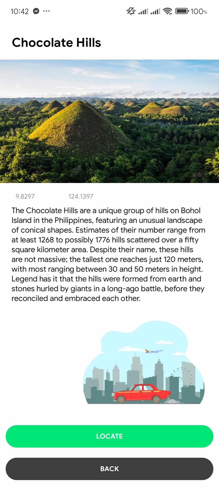
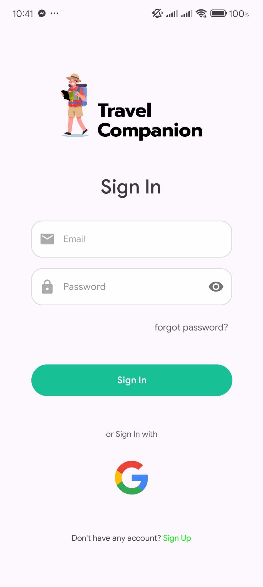
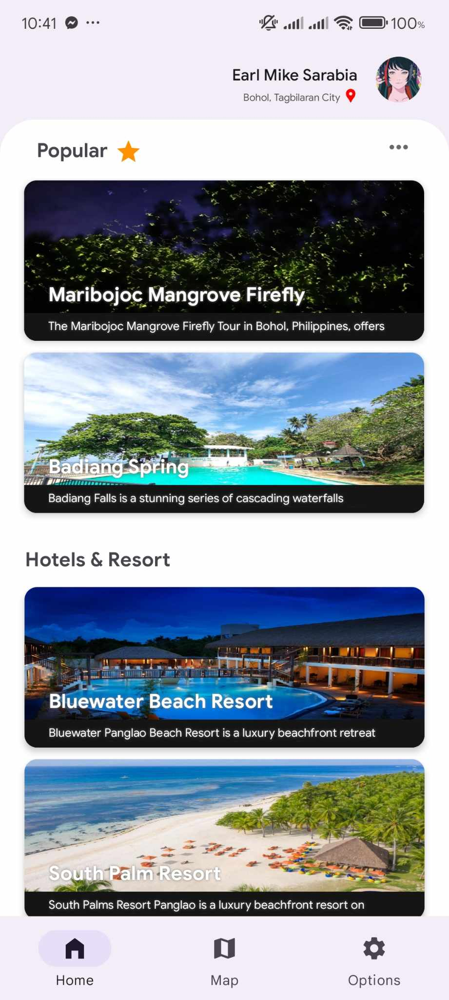

# Travel Companion

  

A mobile application designed to guide users to popular tourist attractions in Bohol, Philippines. Travel Companion leverages **Google Maps** and **OpenStreetView** for an immersive navigation experience, while providing secure and quick login via Google account authentication.

---

## 📱 Features

- Browse and navigate to tourist destinations in Bohol
- Interactive maps with Google Maps integration
- OpenStreetView for virtual previews of locations
- Google account login for quick and secure access
- User-friendly interface optimized for mobile

---

## 🖼 Screenshots

<div style="display: flex; flex-wrap: wrap; gap: 16px; justify-content: center;">


<a href="public/images/Screenshot 2024-11-03 221625.png" target="_blank">
  
</a>

<a href="public/images/Screenshot 2024-11-03 221653.png" target="_blank">
  
</a>
<a href="public/images/Screenshot 2024-11-03 221653.png" target="_blank">
  
</a>

<!-- Add more screenshots here -->

</div>

---

## 🛠 Tech Stack

- **Android Studio** – App development
- **Firebase** – Backend and authentication
- **Google Maps API** – Location services
- **OpenStreetView** – Virtual navigation
- **Java/Kotlin** – Programming language

---

## 🚀 Installation

1. Clone the repository:
```bash
git clone https://github.com/esmike03/TravelCompanion.git
